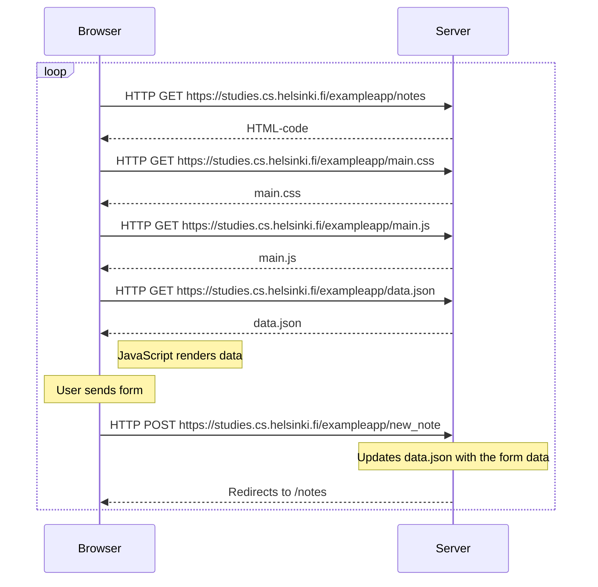

```mermaid
sequenceDiagram
  loop
    Browser->>Server: HTTP GET https://studies.cs.helsinki.fi/exampleapp/notes
    Server-->>Browser: HTML-code
    Browser->>Server: HTTP GET https://studies.cs.helsinki.fi/exampleapp/main.css
    Server-->>Browser: main.css
    Browser->>Server: HTTP GET https://studies.cs.helsinki.fi/exampleapp/main.js
    Server-->>Browser: main.js
    Browser->>Server: HTTP GET https://studies.cs.helsinki.fi/exampleapp/data.json
    Server-->>Browser: data.json
    note right of Browser: JavaScript renders data
    note over Browser: User sends form
    Browser->>Server: HTTP POST https://studies.cs.helsinki.fi/exampleapp/new_note
    note over Server: Updates data.json with the form data
    Server-->>Browser: Redirects to /notes
  end
```
