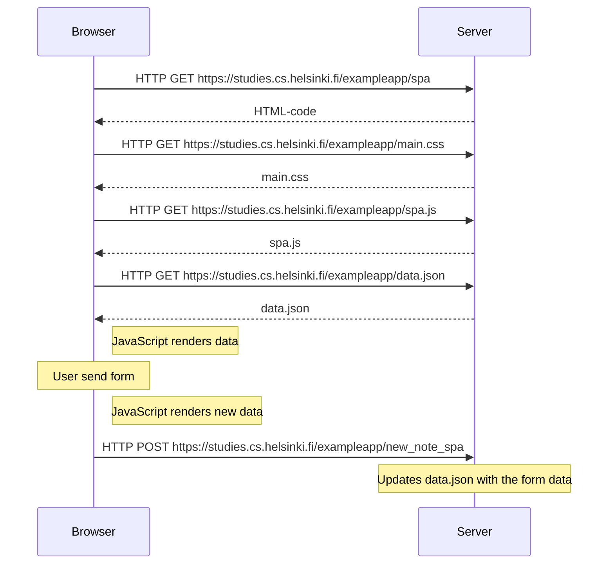

```mermaid
sequenceDiagram
    Browser->>Server: HTTP GET https://studies.cs.helsinki.fi/exampleapp/spa
    Server-->>Browser: HTML-code
    Browser->>Server: HTTP GET https://studies.cs.helsinki.fi/exampleapp/main.css
    Server-->>Browser: main.css
    Browser->>Server: HTTP GET https://studies.cs.helsinki.fi/exampleapp/spa.js
    Server-->>Browser: spa.js
    Browser->>Server: HTTP GET https://studies.cs.helsinki.fi/exampleapp/data.json
    Server-->>Browser: data.json
    note right of Browser: JavaScript renders data
    note over Browser: User send form
    note right of Browser: JavaScript renders new data
    Browser->>Server: HTTP POST https://studies.cs.helsinki.fi/exampleapp/new_note_spa
    note over Server: Updates data.json with the form data
```
